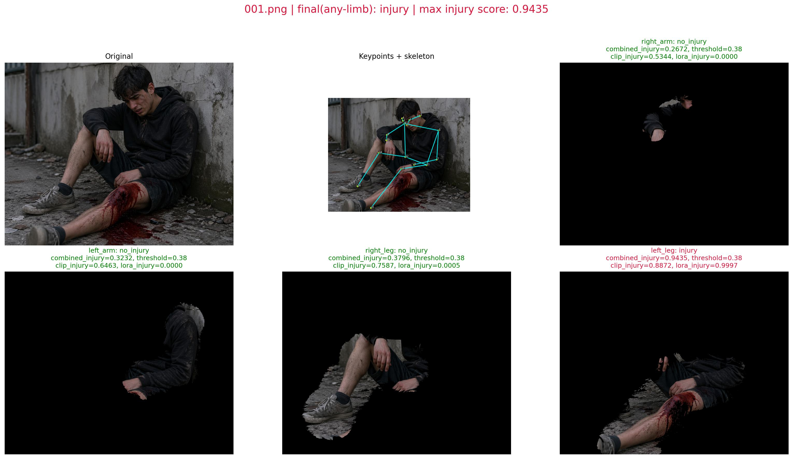

# Keypoint-Guided Gaussian Segmentation + CLIP-LoRA Pipeline

This project detects human pose keypoints, builds limb-focused Gaussian masks, and classifies limb condition using CLIP with optional LoRA weights.

## Preview



## What This Repo Contains

- `pose_gaussian_only.py`: pose + limb Gaussian masking for one image.
- `run_pose_then_clip.py`: end-to-end single-image pipeline (masking -> CLIP/LoRA classification).
- `batch_testing_report.py`: batch report generator with visualization grids and CSV outputs.
- `cv_project_usage.ipynb`: step-by-step notebook demo for the same pipeline.
- `notebooks/01_base_clip_limb_status.ipynb`: base CLIP limb-status notebook.
- `notebooks/02_yolo_pose_limb_crops_clip.ipynb`: pose + Gaussian masking with base CLIP.
- `notebooks/03_yolo_gaussian_lora_clip.ipynb`: pose + Gaussian masking with CLIP + LoRA and the compact limb table.
- `CLIP-LoRA/`: CLIP-LoRA training/inference code and dataset adapters.
- `testing/`: sample test images.

## Environment Setup

```bash
python -m venv .venv
source .venv/bin/activate
pip install --upgrade pip
pip install -r requirements.txt
```

## Model Files

- Pose model default: `yolov8n-pose.pt`
- Base CLIP weights are pulled from the web on first run and cached in `~/.cache/clip/`.
- LoRA checkpoint example: `CLIP-LoRA/weights/lora_weights_960_2.9566854533582632e-05.pt`

Notes:

- If `yolov8n-pose.pt` is not present locally, Ultralytics may auto-download it on first run.
- LoRA is optional. Without `--use_lora`, inference runs in zero-shot CLIP mode.

## Class Labels and Prompts

Default class order:

1. `injury`
2. `no_injury`

The project uses prompt-based CLIP text features. The notebook and batch script currently use prompt ensembling for better stability.

## Quickstart

### 1) Pose + Gaussian mask only

```bash
python pose_gaussian_only.py \
  --input testing/001.png \
  --output Results/splatted_output.jpg \
  --limb left_leg
```

### 2) End-to-end single-image inference

```bash
python run_pose_then_clip.py \
  --input testing/001.png \
  --mode predict \
  --use_lora \
  --lora_save_path CLIP-LoRA/weights/lora_weights_960_2.9566854533582632e-05.pt
```

Important:

- `run_pose_then_clip.py` now uses the current Python interpreter (`sys.executable`) by default.
- You can override interpreter with `--python_executable /path/to/python` if needed.

### 3) Batch report over `testing/`

```bash
python batch_testing_report.py
```

Outputs are written to:

- `Results/batch_reports/*.jpg`
- `Results/batch_reports/summary.csv`
- `Results/batch_reports/part_probabilities.csv`
- `Results/batch_reports/proof_panels/*_proof_panel.png`
- `Results/batch_reports/run_metadata.json`

### 4) Teacher-facing metrics + plots

Prepare/update labels in `testing_labels.csv` (`image,true_label`) and run:

```bash
python evaluate_teacher_metrics.py \
  --summary_csv Results/batch_reports/summary.csv \
  --labels_csv testing_labels.csv \
  --output_dir Results/report_assets_positive
```

Outputs are written to:

- `Results/report_assets_positive/metrics_summary.json`
- `Results/report_assets_positive/metrics_table.csv`
- `Results/report_assets_positive/confusion_matrix.png`
- `Results/report_assets_positive/roc_ovr.png`
- `Results/report_assets_positive/class_distribution.png`
- `Results/report_assets_positive/metrics_bar.png`
- `Results/report_assets_positive/sample_group_panel.png`
- `Results/report_assets_positive/sample_predictions.png`
- `PRESENTATION_EVIDENCE_CHECKLIST.md`

## Notebook

Run `cv_project_usage.ipynb` for an interactive walkthrough:

- pose detection
- keypoint/skeleton visualization
- limb Gaussian masks
- CLIP + LoRA probability tables
- image-level injury summary

The focused notebook variants in `notebooks/` show the same pipeline in smaller pieces:

- `01_base_clip_limb_status.ipynb` uses a simple base-CLIP table.
- `02_yolo_pose_limb_crops_clip.ipynb` shows pose-guided crops with the five-column limb table.
- `03_yolo_gaussian_lora_clip.ipynb` shows the Gaussian + CLIP-LoRA flow with the same five-column table:
  `Limb`, `Predicted Class`, `Binary Label`, `Injury Score`, `No-Injury Prob`.

## Submission Notes

This repo includes `.gitignore` for generated artifacts (`Results/`, `__pycache__/`, notebook checkpoints, etc.) so reruns do not pollute source control.

Generated notebook outputs such as `notebooks/generated_outputs/` and report assets under `Results/` are reproducible and can be regenerated at any time.

For final submission, keep source files and sample inputs; generated outputs are optional unless explicitly requested by your course.

## Troubleshooting

### LoRA checkpoint error

- Confirm the file path passed via `--lora_save_path` (or notebook variable) exists.

### Torch attention compatibility

- `CLIP-LoRA/loralib/layers.py` includes a fallback attention path for environments that do not expose `scaled_dot_product_attention`.

### No person detected

- Try a clearer image, a different crop, or a different limb.

## Minimal Repo Review Checklist

Before submitting:

1. `pip install -r requirements.txt` succeeds.
2. `python run_pose_then_clip.py --input testing/001.png --mode predict` runs.
3. `python batch_testing_report.py` runs and writes reports.
4. README commands match actual file paths in your repo.
